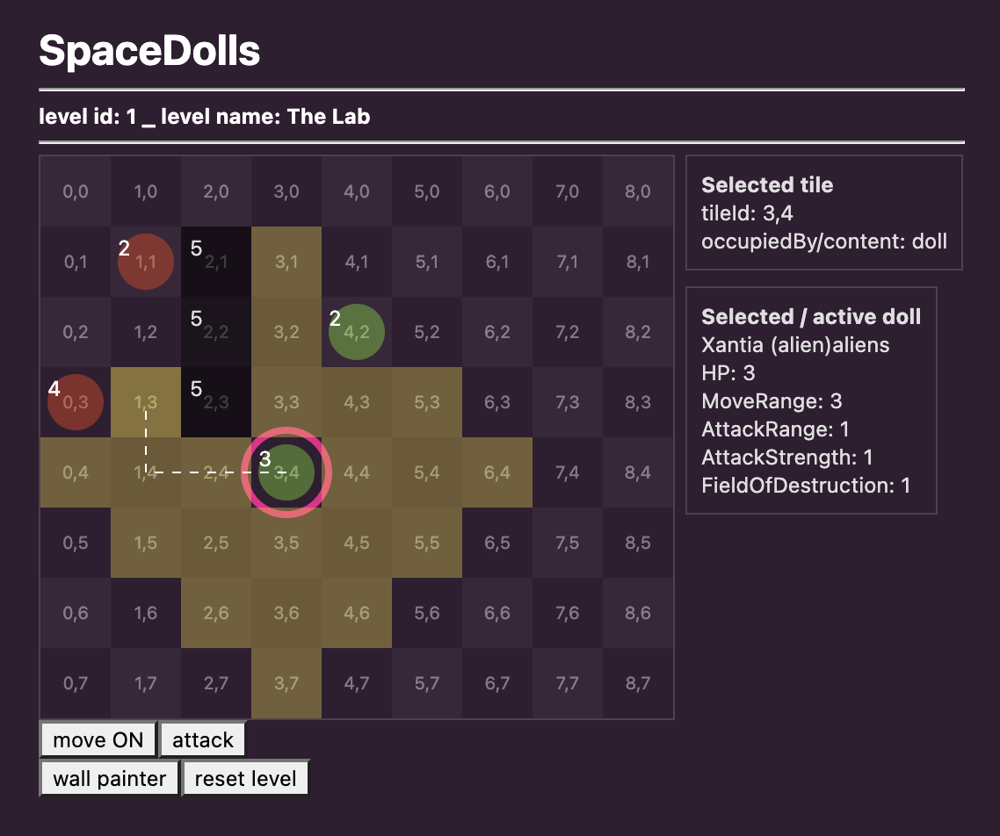

# SpaceDolls

React turn based tactics playground | 2019

## Main assumptions

- React no class, only hooks
- Redux hooks api https://react-redux.js.org/api/hooks
- no images, html and svg only
- ~~sass support~~ (work fine, but let's try without it)
- only https://www.styled-components.com/
- some new animation engine https://www.react-spring.io/ or https://github.com/FormidableLabs/react-animations
- ~~Blueprint~~ (or ~~AntDesign~~ or anything other than Bootstrap/Reactstrap to try and learn new tricks)
- [Blueprint colors](https://blueprintjs.com/docs/#core/colors)
- edited and running on public codesandbox
- connected and hosted on public github repo
- with working Redux tools and history preview
- for fun and learn

### Secondary features

- no font icons?
- no ajax for now
- with tests
- Redux hooks without any optimization (memorizing) for now

### Other things (and thinks) that came out during the process

- we need `polished` because styled component isn't enough :(
- reboot, normalized, reset... we still do the same things in different tech
- `Immutable`, `Immer` ... - I finally understand the big 'Why' behind you
- do I really still need `lodash`?
- es6 `Map` is... but I will try again
- `blueprintjs` is a complete solution not the simple set of components that we can grab and use outside of it

## Basic

### Coordinates system

**like screen (x,y)**

- x from 0 to width (css left, column)
- y from 0 to height (css top, row)

https://koenig-media.raywenderlich.com/uploads/2013/05/Tiled-java-Coordinates.jpg
https://omaharentalads.com/explore/Java-drawing-pixel/#gal_post_6051_java-drawing-pixel-3.png

### Some logic structure assumptions

data
- use nothing
- used only by `utils`

utils
- use `data` and other `utils`
- used by `components`, `redux` and other `utils`

redux
- use `utils`
- used by `components`
